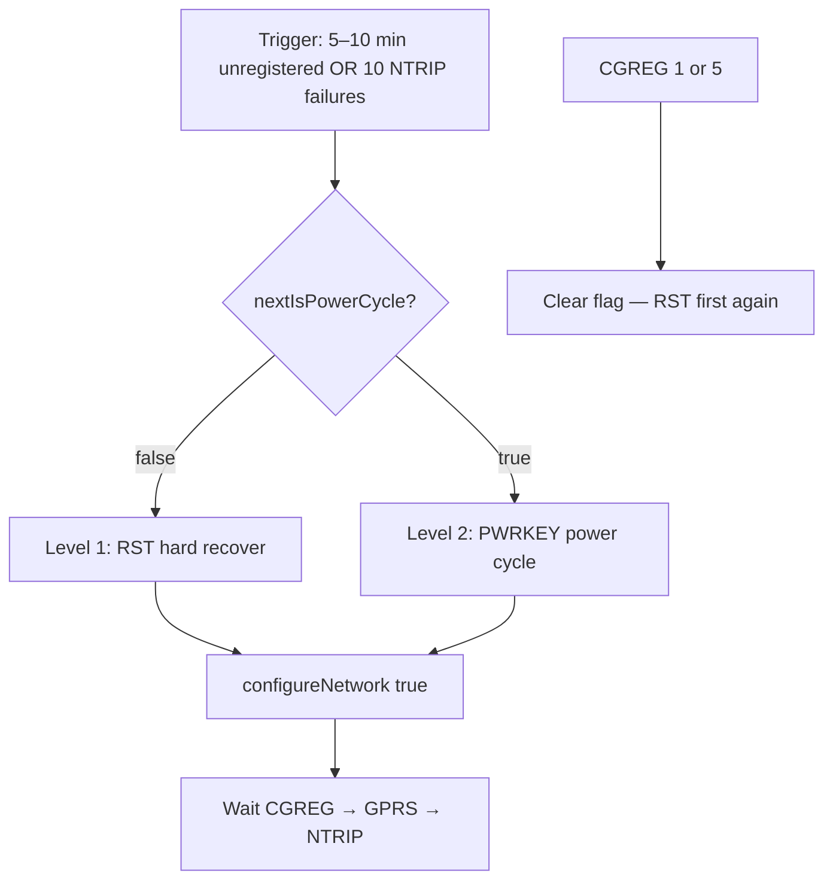

# Failure paths and recovery (`buoy_combo`)

How the buoy detects outages, tears down the cellular data path, and recovers the SIM7000.

| Doc | Use |
|-----|-----|
| [student-guide.md](student-guide.md) | Theory — RTK, power, telemetry pipeline |
| [../README.md](../README.md) | Flash, deploy, troubleshooting tables |
| This file | Recovery triggers, cooldowns, serial logs |

---

## Recovery modes at a glance

| Mode | When it runs | Cooldown | What restarts | Serial log |
|------|----------------|----------|---------------|------------|
| **GPRS refresh** | `CGREG` OK but no RTCM/telemetry for **5 min** | **2 min** | PDP + CIP only | `[GPRS] refresh: data path stale` |
| **Data invalidate** | Confirmed `CGREG` loss or refresh | — | NTRIP + GPRS flag | `[DATA] invalidate: <reason>` |
| **RST hard recover** | 1st escalated trigger | **10 min** | Modem RST + `configureNetwork(true)` | `[MODEM] hard recover: <reason>` |
| **PWRKEY power cycle** | 2nd escalated trigger after RST | **15 min** | `AT+CPOWD` + PWRKEY + `modem.begin()` | `[MODEM] power cycle: <reason>` |
| **ESP32 boot / reset** | Power-on, reset, re-flash | — | Full `setup()` | `Powering on modem...` → `Setup complete` |
| **Shutdown button** | GPIO 0 | — | `AT+CPOWD=1`, ESP light sleep | `=== SHUTDOWN REQUESTED ===` |

**Escalation:** RST first → power cycle on the **next** trigger. Resets to RST-first when `CGREG` is **1** or **5** again.

### Escalated recover triggers

| Trigger | Condition | Timeout / threshold | Reason string |
|---------|-----------|---------------------|---------------|
| Registration timeout | `CGREG` not 1 or 5 | **5 min** (or **10 min** if searching + good `CSQ`) | `registration timeout` |
| NTRIP failure streak | GPRS up, NTRIP down | **10** failures | `NTRIP failures` |

**Not** escalated: single NTRIP fail, one bad `CGREG` with RTCM active, carrier outage alone.

---

## Escalation flow



---

## Boot vs recover (`configureNetwork`)

| Path | Called from | Radio | Band config | Log |
|------|-------------|-------|-------------|-----|
| **Boot** | `setup()` → `configureNetwork(false)` | `setFunctionality(1)` first | `configureLteCatM(false)` at **CFUN=1** | `(boot)` |
| **Recover** | RST / power cycle → `configureNetwork(true)` | Optional `CFUN=0` | `configureLteCatM(true)` + `ensureCfun1()` | `(recover)` |

| Log | Meaning |
|-----|---------|
| `[MODEM] SKIP band config — CPIN: ...` | SIM not `READY` |
| `[MODEM] WARN: modem not AT-ready before config` | AT wait timed out; config still runs |
| `[MODEM] CBANDCFG: ...` | Active band table |

Default band **12**; fallback **2,4,12,13** (`LTE_CATM_US_FALLBACK`). Verizon: `LTE_CATM_BAND` **13** in `buoy_combo.h`.

---

## CGREG loss

- Ignored **2 min** while RTCM/cellular activity active (`CELLULAR_LINK_ALIVE_MS`).
- **2** bad polls without grace → `[DATA] invalidate`, `[NET] registration lost`.

## GPRS refresh (zombie PDP)

`CGREG` OK, no data **5 min** → `[GPRS] refresh` (2 min cooldown). Does not run on CNACT `0.0.0.0` alone while `[RTCM]` active.

## Telemetry vs NTRIP

Every `TELEMETRY_INTERVAL_MS` (default **60 s**): close NTRIP → Hologram send → reconnect. Can worsen a marginal link; increase interval in `secrets.h`.

## Manual recovery

| Action | Effect |
|--------|--------|
| ESP32 reset | Full `setup()` / `configureNetwork(false)` |
| GPIO 0 shutdown | Modem off; **reset ESP32** to boot modem again |
| Battery disconnect ~30 s | Full power cycle |

## Example field cascade

```
[NET] CSQ=0 CGREG=5 (roaming)
[NET] CSQ=0 CGREG=0 (not registered)
[HEALTH] CGREG=0 ignored (RTCM active)
[TELEM] Hologram failed
[NTRIP] TCP connect failed
[HEALTH] network lost
[DATA] invalidate: CGREG health
[GPS] fix=3 rtk=none
[MODEM] hard recover: registration timeout
[MODEM] LTE CAT-M, band 12 (recover)
... still CGREG=0 ...
[MODEM] power cycle: registration timeout
```

RTK returns after: `CGREG` 1/5 → `[GPRS] enabled` → `[NTRIP] connected` → `[RTCM]` → `rtk=FIXED`.

## Carrier / Hologram

Check [Hologram status](https://status.hologram.io). US2 profiles (ICCID **89418…**) may see intermittent connectivity — firmware cannot override carrier outages.

## Serial tags

| Tag | Meaning |
|-----|---------|
| `[NET]` | CSQ, CGREG; `connected`, `registration lost` |
| `[HEALTH]` | net/rssi/gprs/ntrip/fail; `network lost` |
| `[DATA] invalidate` | Data path torn down |
| `[GPRS] refresh` | PDP/CIP refresh (not PWRKEY cycle) |
| `[MODEM] hard recover` | RST + recover config |
| `[MODEM] power cycle` | Full PWRKEY cycle |
| `[MODEM] * skipped (cooldown)` | Recover blocked by timer |
| `[NTRIP] fail streak=N` | Toward escalated recover |
| `[TELEM] Hologram failed` | Telemetry socket fail after NTRIP close |

## Tunables (`buoy_combo.h` / `secrets.h`)

| Define | Default |
|--------|---------|
| `UNREGISTERED_HARD_RECOVER_MS` | 5 min |
| `UNREGISTERED_SEARCHING_GRACE_MS` | 10 min |
| `MODEM_HARD_RECOVER_COOLDOWN_MS` | 10 min |
| `MODEM_POWER_CYCLE_COOLDOWN_MS` | 15 min |
| `NTRIP_FAILURES_BEFORE_HARD_RESET` | 10 |
| `DATA_PATH_STALE_MS` | 5 min |
| `CELLULAR_LINK_ALIVE_MS` | 2 min |
| `TELEMETRY_INTERVAL_MS` | 60 s (`secrets.h`) |
| `CGREG_BAD_STREAK_LIMIT` | 2 |
| `GPRS_REFRESH_COOLDOWN_MS` | 2 min |
| `NETWORK_RECHECK_MS` | 30 s (registered) |

## Related docs

- [student-guide.md](student-guide.md) — §3.1 firmware state machine (theory)
- [firmware-walkthrough.md](firmware-walkthrough.md) — function map
- [at-command-primer.md](at-command-primer.md) — CGREG, CSQ, CPIN
- [../README.md](../README.md) — deployment and troubleshooting
- [README.md](README.md) — full documentation index
