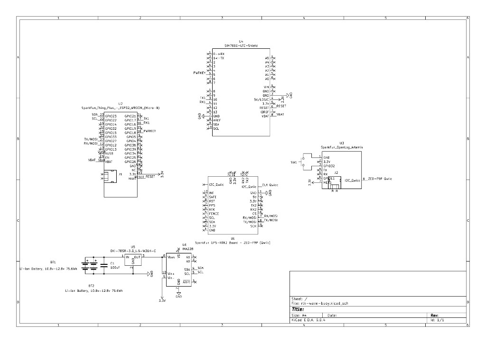

# Hardware specification — RTK Wave Buoy

Electrical and mechanical reference for the deployed **rtk-wave-buoy** stack (KiCad schematic). Pin-level ESP32 mapping: [wiring-and-pins.md](wiring-and-pins.md).

---

## System wiring diagram

KiCad project: **rtk-wave-buoy** (KiCad 9.0.4).



| Sheet block | Part | Role |
|-------------|------|------|
| U2 | SparkFun Thing Plus — ESP32 WROOM | Main controller: LTE, NTRIP, telemetry, health |
| U4 | SIM7000 LTE Shield | Cellular modem (UART + PWRKEY) |
| U1 | SparkFun GPS-RTK2 — ZED-F9P | GNSS / RTK (Qwiic + UART in firmware) |
| U3 | SparkFun OpenLog Artemis | SD logging, ICM-20948 IMU |
| U6 | INA228 | Pack voltage, current, power (I2C) |
| U5 | OKI-78SR-3.3 | DC-DC: pack voltage → **3.3 V** logic rail |
| BT1, BT2 | Li-ion packs | Parallel battery inputs |
| C1 | 100 µF | Input bulk capacitance on pack bus |

---

## Battery system

| Parameter | Value |
|-----------|--------|
| Configuration | **2×** Li-ion **3S2P** packs, wired in **parallel** |
| Energy per pack | **75 Wh** (schematic: 75.6 Wh) |
| **Total energy** | **~150 Wh** |
| Pack voltage (operating) | **10.8 V – 12.8 V** (3S fully discharged → fully charged) |
| Nominal | ~**11.1 V** (3S @ 3.7 V/cell) |

### Parallel operation

Both packs connect **positive-to-positive** and **negative-to-negative** on a shared bus:

- **Capacity adds:** 75 Wh + 75 Wh ≈ **150 Wh** usable (when packs are matched).
- **Voltage:** Bus stays at single-pack voltage (~11 V nominal), not doubled.
- **Redundancy:** If one pack is removed or fails open, the other can continue to supply the bus (verify pack protection and wiring in your build).

Each **3S2P** pack is three cells in series and two strings in parallel (higher pack current capability than 3S1P). Use matched packs of the same state of charge when paralleling.

---

## Power distribution

```text
BT1 (3S2P, 75 Wh) ──┐
                      ├── Pack bus ── INA228 (sense) ── OKI-78SR-3.3 ── 3.3 V rail
BT2 (3S2P, 75 Wh) ──┘         │
                           C1 100 µF
```

| Stage | Part | Output |
|-------|------|--------|
| Input | Parallel Li-ion bus | 10.8–12.8 V |
| Monitor | INA228 (U6) | `bus_v`, current, `power_mw` to ESP32 over I2C |
| Regulate | OKI-78SR-3.3 (U5) | **3.3 V** for ESP32, SIM7000, ZED, OLA (per schematic) |
| Bench | ESP32 USB | USB can power logic; INA228 may not reflect pack voltage |

Firmware reports INA228 readings in telemetry as `bus_v` and `power_mw` ([data-formats.md](data-formats.md)).

---

## Communications (from schematic + firmware)

| Link | Connection |
|------|------------|
| **I2C (Qwiic)** | ESP32 SDA **23**, SCL **22** → INA228, ZED-F9P, OpenLog Artemis |
| **UART1** | ESP32 TX **17** / RX **16** ↔ SIM7000 RX / TX |
| **PWRKEY** | ESP32 GPIO **18** → SIM7000 PWRKEY (power-on / recovery) |
| **UART2** | ESP32 TX **12** / RX **27** ↔ ZED UART1 — RTCM + PVT in `buoy_combo` ([wiring-and-pins.md](wiring-and-pins.md)) |
| **Reset** | ESP32 EN / modem RST (see schematic `ESP32_RESET` net) |

OLA logs GNSS over **I2C**; ESP32 injects RTCM over **UART2** concurrently.

---

## Power budget (estimate)

Illustrative duty at **3.3 V** logic rail; adjust from field `power_mw` telemetry.

| Component | Approx. current @ 3.3 V | Approx. power |
|-----------|-------------------------|---------------|
| ZED-F9P + antenna | ~100 mA | ~0.33 W |
| SIM7000 (average) | ~150 mA | ~0.50 W |
| ESP32 | ~100 mA | ~0.33 W |
| OpenLog Artemis | ~50 mA | ~0.17 W |
| **Subtotal (3.3 V)** | | **~1.3 W** |

With ~**85%** DC-DC efficiency from an **11 V** pack: $P_{\text{pack}} \approx 1.3 / 0.85 \approx 1.5\text{ W}$.

| Metric | Value |
|--------|--------|
| Stored energy | **150 Wh** |
| Estimated runtime @ 1.5 W | **~100 h** (~4 days) continuous |
| LTE transmit peaks | Short spikes above average — budget margin recommended |

---

## Bill of materials (core electronics)

| Item | Notes |
|------|--------|
| 2× Li-ion **3S2P** 75 Wh packs | Parallel, matched SOC |
| SparkFun ESP32 Thing Plus | U2 |
| Botletics SIM7000 LTE shield | U4 |
| SparkFun ZED-F9P-02B + ANN-MB1 antenna | U1 |
| SparkFun OpenLog Artemis + microSD (FAT32) | U3 |
| Adafruit INA228 (Qwiic) | U6 |
| OKI-78SR-3.3 (or equivalent 3.3 V buck from pack) | U5 |
| Hologram SIM | LTE data |

---

## Related documentation

- [system-architecture.md](system-architecture.md) — software / data paths
- [wiring-and-pins.md](wiring-and-pins.md) — GPIO table
- [deployment-checklist.md](deployment-checklist.md) — pre-float checks
- [student-guide.md](student-guide.md) §1 — power theory
- [../README.md](../README.md) — quick start and flash
