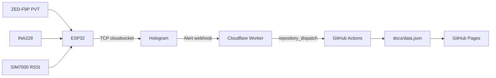

# System architecture

High-level view of the RTK Wave Buoy: hardware blocks, data paths, and where to read more.

Theory detail: [student-guide.md](student-guide.md). Pin numbers: [wiring-and-pins.md](wiring-and-pins.md). Firmware flow: [firmware-walkthrough.md](firmware-walkthrough.md).

---

## Physical stack

```text
        BT1 (3S2P, 75 Wh) ──┐
                            ├── Pack bus (~11 V) ── INA228 ── DC-DC → 3.3 V
        BT2 (3S2P, 75 Wh) ──┘                              │
                    ~150 Wh total                          │
                         ┌─────────────────────────────────┼──────────────┐
                         │                                 │              │
                   SIM7000 shield                   OpenLog Artemis    ESP32 Thing Plus
                   UART1 + PWRKEY                   I2C → ZED (log)    I2C + UART2 → ZED (RTCM)
```

Wiring diagram: [hardware-spec.md](hardware-spec.md).

| Node | Role |
|------|------|
| **ESP32** (`buoy_combo`) | LTE registration, NTRIP client, RTCM relay to ZED UART, Hologram telemetry, INA228 read, connection health / modem recovery |
| **OpenLog Artemis (OLA)** | High-rate UBX logging + ICM-20948 IMU to microSD; shares ZED on Qwiic I2C |
| **ZED-F9P** | RTK GNSS; RTCM corrections on UART1 (from ESP32); position to ESP32 (UART PVT) and OLA (I2C logging) |
| **SIM7000** | LTE CAT-M, TCP to NTRIP caster and Hologram Cloud Socket |

Power detail: [hardware-spec.md](hardware-spec.md), [student-guide.md](student-guide.md) §1.

---

## Two data paths

### Live telemetry (minutes-scale)



- Interval: `TELEMETRY_INTERVAL_MS` (default 60 s) in `secrets.h`
- NTRIP socket closes briefly during each telemetry send
- Setup: [../README.md](../README.md), [../cloudflare_worker/README.md](../cloudflare_worker/README.md)
- Payload: [data-formats.md](data-formats.md)

### Field logging (high-rate, offline)

```text
ZED-F9P ──I2C──► OLA ──► microSD
              ├── dataLogNNNNN.ubx   (GNSS binary)
              └── imuLogNNNNN.csv    (IMU, menu-dependent columns)
```

Post-processing: `ubx_parsers/v3_ubx_parser.py` → CSV → `Visualizer/`. See [data-formats.md](data-formats.md).

---

## ESP32 runtime (summary)

```text
setup:  INA228 + ZED UART + modem power-on + configureNetwork(boot)
loop:   CGREG/GPRS → NTRIP/RTCM → health monitor → telemetry → status print
```

Recovery (RST → PWRKEY): [failure-paths.md](failure-paths.md).

---

## Communications buses

| Bus | Devices | Purpose |
|-----|---------|---------|
| **I2C** (ESP32) | INA228 @ 0x40 | Pack bus voltage / current / power |
| **I2C** (OLA Qwiic) | ZED @ 0x42, ICM-20948 | SD logging (independent of ESP32 loop) |
| **UART1** | ESP32 ↔ SIM7000 | AT commands, NTRIP TCP, Hologram TCP |
| **UART2** | ESP32 ↔ ZED UART1 | RTCM3 in, UBX PVT out for live fix/telemetry |

Serial protocols: [student-guide.md](student-guide.md) §3.3.

---

## Configuration surfaces

| What | Where |
|------|--------|
| NTRIP caster, Hologram key, telemetry interval | `esp32/buoy_combo/secrets.h` |
| LTE band, recovery timeouts | `esp32/buoy_combo/buoy_combo.h` |
| OLA log rates / IMU enables | OLA serial menu (115200) — [../README.md](../README.md) §2 |
| Dashboard repo/branch | `docs/config.js` |
| Cloudflare → GitHub | `cloudflare_worker/worker.js` env vars |

---

## Related docs

| Topic | Document |
|-------|----------|
| Reading order | [learning-path.md](learning-path.md) |
| Pins | [wiring-and-pins.md](wiring-and-pins.md) |
| Code map | [firmware-walkthrough.md](firmware-walkthrough.md) |
| File formats | [data-formats.md](data-formats.md) |
| Pre-float checks | [deployment-checklist.md](deployment-checklist.md) |
