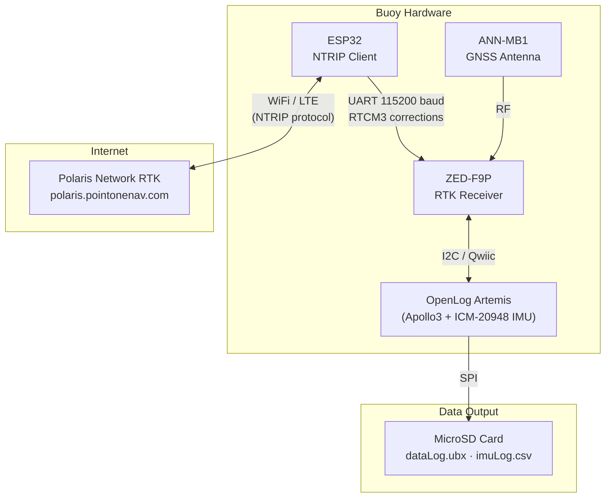

# RTK Wave Buoy — System Block Diagram

This diagram shows the hardware components, communication links, and data flow of the RTK GPS wave buoy system.

## Component Summary

| Component | Role |
|-----------|------|
| **ANN-MB1 Antenna** | Multi-band GNSS antenna |
| **ZED-F9P** | RTK GNSS receiver — computes cm-level position using RTCM corrections |
| **OpenLog Artemis (OLA)** | Data logger — reads ZED-F9P via I2C, samples built-in IMU, writes to SD |
| **ICM-20948 IMU** | Built into OLA — 9-DoF accelerometer/gyroscope/magnetometer at 10 Hz |
| **ESP32** | NTRIP client — fetches RTK corrections from Polaris and forwards to ZED-F9P via UART |
| **Polaris Network RTK** | Cloud NTRIP caster — streams RTCM3 correction messages |
| **MicroSD Card** | Stores raw UBX GPS data (`dataLog.ubx`) and IMU CSV (`imuLog.csv`) |
